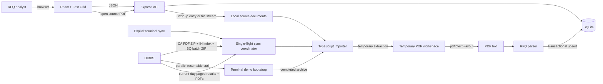
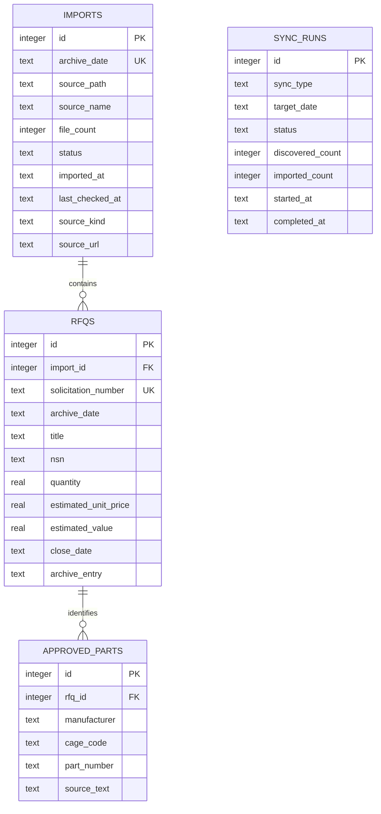
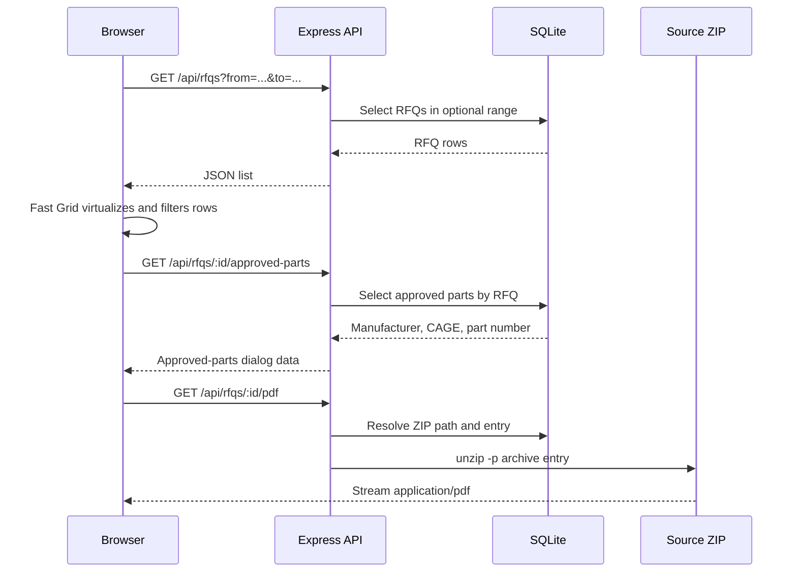

# Sales Patriot architecture

Sales Patriot is a local-first RFQ review application. A TypeScript synchronization process combines official completed-day DIBBS downloads with an incremental current-day portal scrape. Both paths produce the same normalized SQLite records. The React client loads all stored days by default, accepts optional date bounds, and uses Fast Grid for responsive client-side scrolling, sorting, and filtering.

## Current stack

| Layer | Technology | Responsibility |
| --- | --- | --- |
| Client | React 19, TypeScript, Vite | Application shell, archive-day selection, RFQ and approved-parts dialogs |
| Grid | Fast Grid at commit `21a7ee2` | Virtualized DOM rows, client-side filters and sorting |
| Styling | Tailwind CSS 4 and application CSS | Compiles Fast Grid’s utility classes and supplies the application design system |
| API | Express 5, TypeScript, Zod | JSON CRUD API, approved-parts lookup, source-PDF streaming |
| Database | SQLite, `better-sqlite3` | Archive imports, RFQ metadata, and approved part numbers |
| Sync runtime | Node.js, native `fetch`, `unzip`, Poppler `pdftotext` | DIBBS consent/session handling, downloads, portal paging, PDF conversion, transactional persistence |

Fast Grid uses `SharedArrayBuffer`. Both Vite and Express therefore return `Cross-Origin-Opener-Policy: same-origin` and `Cross-Origin-Embedder-Policy: require-corp` headers.

## System architecture



Completed-day ZIPs remain the source of truth for archived document bytes. Current-day PDFs are retained individually until the official archive replaces that live day. The database stores paths rather than PDF blobs, and all downloaded material is excluded from Git.

## Two-stage DIBBS sync

DIBBS publishes three complementary completed-day files. Sales Patriot intentionally uses all three:

| DIBBS file | Contents | Use |
| --- | --- | --- |
| `caYYMMDD.zip` | Original RFQ PDFs | Full form text, source document, procurement history |
| `inYYMMDD.txt` | Fixed-width RFQ index | Fast, deterministic core metadata and filenames |
| `bqYYMMDD.zip` | 121-field batch-quote CSV plus `asYYMMDD.txt` | Quantity/delivery enrichment and authoritative approved sources |

The archive synchronizer discovers the newest complete triplet, downloads files atomically through `.part` files, and skips a day already marked as a complete archive. It does not rewrite historical days during routine operation.

For demos or recovery on a constrained connection, `npm run sync:manifests` stages the configured published-archive horizon from only the small index and batch files. These rows are marked `archive-manifest`, appear in the grid immediately, and remain eligible for the normal full-archive pass. Buyer name, supply chain, and NAICS are unavailable in those compact files and remain empty until the eventual PDF ZIP import atomically replaces the staged rows with PDF-derived details and working local document links.

`npm run demo:bootstrap -- --limit 7 --concurrency 3` is the operator-oriented fast path. It first runs that manifest stage, then obtains the DIBBS consent cookie and hands it to parallel resumable `curl` processes. Each transfer writes a `.part` file and must pass `unzip -t` before it is promoted. Completed archives enter a single sequential ingestion queue immediately, so SQLite enrichment overlaps the remaining network transfers without multiple archive imports contending for CPU, temporary disk, or the database. The command can be rerun after interruption. `npm run import:directory -- /path` provides the same sequential ingestion for a directory tree of previously downloaded `caYYMMDD.zip` files and uses colocated index/batch files when present.

DIBBS does not expose the completed files while a day is still changing. For that gap, the live synchronizer:

1. accepts the DOD consent screen and retains cookies independently per DIBBS host;
2. searches the portal for the current Eastern Time date;
3. follows ASP.NET GridView postback pages with bounded parallelism (six concurrent pages by default) and extracts solicitation, NSN, title, and PDF URL;
4. stages each scraped result page in SQLite immediately, with the original DIBBS PDF URL as a temporary document target, so the polling grid gains rows during portal discovery;
5. compares solicitation numbers with locally downloaded documents and fetches only missing PDFs;
6. converts those PDFs with the same parser and upserts them in 20-document transactions, allowing richer fields to appear during a long run and a restarted process to resume from durable progress.

When the next completed archive is imported, it replaces that date's live rows and removes the temporary live-document directory. Portal requests have a 30-second deadline, large atomic file transfers have a 30-minute deadline, transient server responses are retried, and only one terminal synchronization may run at once.

## Archive ingestion

Run an import with:

```bash
npm run import -- /path/to/CA260927.ZIP
```

The importer performs these steps:

1. Infers the archive day from the filename. `CA260927.ZIP` becomes `2026-09-27`.
2. Creates a temporary operating-system directory and extracts the archive with `unzip`.
3. Finds every PDF recursively and processes up to eight files concurrently.
4. Runs Poppler with `pdftotext -layout -f 1 -l 12`. Layout preservation matters because the source forms encode several fields by column position.
5. Parses the text into normalized RFQ and approved-part records.
6. Replaces that archive day inside one SQLite transaction, making repeat imports idempotent.
7. Deletes the temporary PDFs. The ZIP itself remains in its original location.

The archive date and document issue date are deliberately separate. For example, `CA260927.ZIP` is the September 27 archive, while its PDFs may say they were issued September 28.

### Extracted RFQ fields

The parser currently recognizes both the common `T` solicitation layout and the alternate `Q` layout. It extracts:

- solicitation number and item description;
- NSN and purchase request;
- requested quantity and unit of issue;
- issue date, quote-close date, and delivery days;
- buyer name, buyer code, and email;
- issuing agency, supply chain, and NAICS code;
- latest historical awarded unit cost and an estimated RFQ value;
- source filename and uncompressed PDF size.

Parsing is deterministic and intentionally conservative. Missing source values remain `NULL` instead of being inferred.

The estimated RFQ value is not a submitted vendor bid—the RFQ unit-price fields are blank by design. It is calculated as requested quantity × the most recent unit cost in the document's procurement-history table. The compact grid summary adds these estimates for the currently filtered rows, so both its RFQ count and dollar total react to Fast Grid column filters.

### Approved parts extraction

Approved parts are read only from Section B, before the next lettered section. A normalized source line generally has this form:

```text
EATON AEROQUIP LLC 00624 P/N 321-62-475S
```

It becomes:

| Field | Value |
| --- | --- |
| Manufacturer | `EATON AEROQUIP LLC` |
| CAGE code | `00624` |
| Part number | `321-62-475S` |

Pairs are deduplicated per RFQ by CAGE code and part number. Restricting extraction to Section B prevents blank offer forms and later FAR/DFARS clauses containing the words “CAGE code” or “part number” from being mistaken for approved sources.

## Data model



The database is created and migrated at server/import startup. It lives at `data/salespatriot.sqlite` by default and is excluded from Git.

## Request and interaction flow



In the grid, clicking an NSN opens the approved-parts dialog. Clicking another cell opens a compact RFQ specification panel styled like the grid, while the document icon beside a solicitation opens its source PDF directly.

## Filtering and saved views

Filtering has three composable layers:

1. A whole-table search scans every displayed field.
2. Each Fast Grid column retains its quick substring input and has a funnel button that opens the Boolean filter builder preselected to that field.
3. The filter builder combines typed conditions with either `AND` or `OR`. Text, numeric, and date fields expose appropriate operators, including relative conditions such as “close date is within the next 7 days.”

The RFQ count and estimated bid value are recomputed from the final result across all three layers. “Save current filter as tab” stores the whole-table query, Boolean rule group, quick column filters, and column widths together in browser local storage. A saved tab behaves as a live filter view: while it is active, every filter or width change is persisted automatically. **All RFQs** keeps its own width layout while still resetting filters and sorting. Selecting a tab restores its complete state immediately. Tabs can be created blank, duplicated into independent copies, or deleted without modifying RFQ data.

Each saved tab can also be serialized into a versioned, URL-safe hash. `All RFQs` is the unfiltered local default, so it is not shareable. Opening a shared link validates its fields, operators, column indexes, and size limits before adding it as a new local tab; the import payload is then removed from the address bar to prevent duplicate imports on refresh. The same `+` control accepts a pasted share URL. No server-side account or saved-view record is required.

The Boolean builder expands to the table width and shifts the grid down while it is being edited. Approved parts use a lightweight table-native popout beside the selected NSN, without dimming or blocking the grid.

Buyer insights are computed entirely from the active in-memory view. Only open RFQs contribute to buyer totals and treemap area. Spend tiers map to `<$50k`, `$50k–250k`, `$250k–1m`, and `$1m+`. The purple relationship marker is deterministic seeded demo data until an award-history or CRM source is connected, so it remains stable between refreshes without being mistaken for imported DIBBS metadata.

Fast Grid receives the complete row store only when the API dataset changes. Filter-tab changes reuse cached in-memory result arrays and replace only the grid's compact `Uint32Array` view index, preserving Fast Grid's recycled viewport DOM. A dedicated browser worker receives cell values once per dataset, precomputes both directions for every single-column sort, and caches requested multi-column or filtered-view orders. Sorting therefore never blocks tab creation or tab navigation on the UI thread.

## API surface

| Method | Route | Purpose |
| --- | --- | --- |
| `GET` | `/api/health` | Process health |
| `GET` | `/api/days` | Available dates, source types, counts, and last checks |
| `GET` | `/api/rfqs?from=YYYY-MM-DD&to=YYYY-MM-DD` | RFQs in optional inclusive date bounds; no bounds returns all |
| `GET` | `/api/sync/status` | Latest completed run and active in-memory progress |
| `POST` | `/api/sync/latest` | Start a background configured-horizon backfill plus current-day check |
| `POST` | `/api/sync/resync` | Explicitly replace one stored day |
| `GET` | `/api/rfqs/:id` | One RFQ |
| `POST` | `/api/rfqs` | Create an RFQ |
| `PATCH` | `/api/rfqs/:id` | Update an RFQ |
| `DELETE` | `/api/rfqs/:id` | Delete an RFQ |
| `GET` | `/api/rfqs/:id/approved-parts` | Approved manufacturer/CAGE/part-number rows |
| `GET` | `/api/rfqs/:id/pdf` | Stream the original PDF from its ZIP entry |

## Scheduling and stability

The API process is intentionally read-only with respect to synchronization: it exposes no sync endpoints and starts no scheduler. Operators run the single-flight CLI manually. Routine archive imports skip finalized days, while a live run downloads only PDFs not already local. If a CLI process stops mid-run, staged rows and completed 20-document batches remain durable and the next run resumes with the missing documents. Refreshing the browser can never start a download; completed attempts remain recorded in `sync_runs` for the “Last synced” reading.
